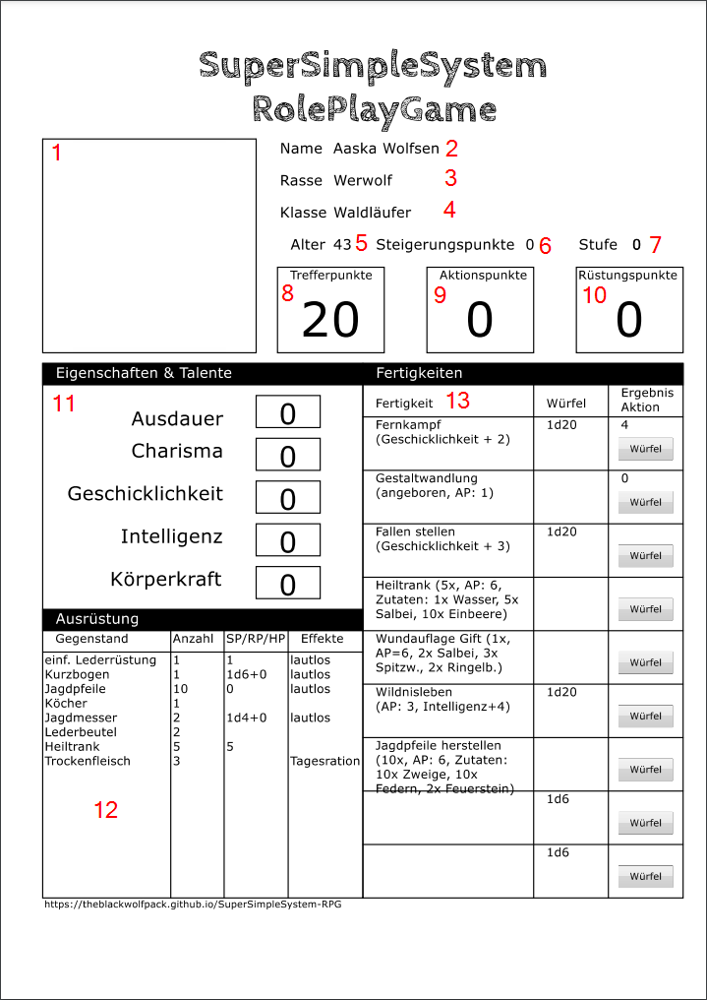
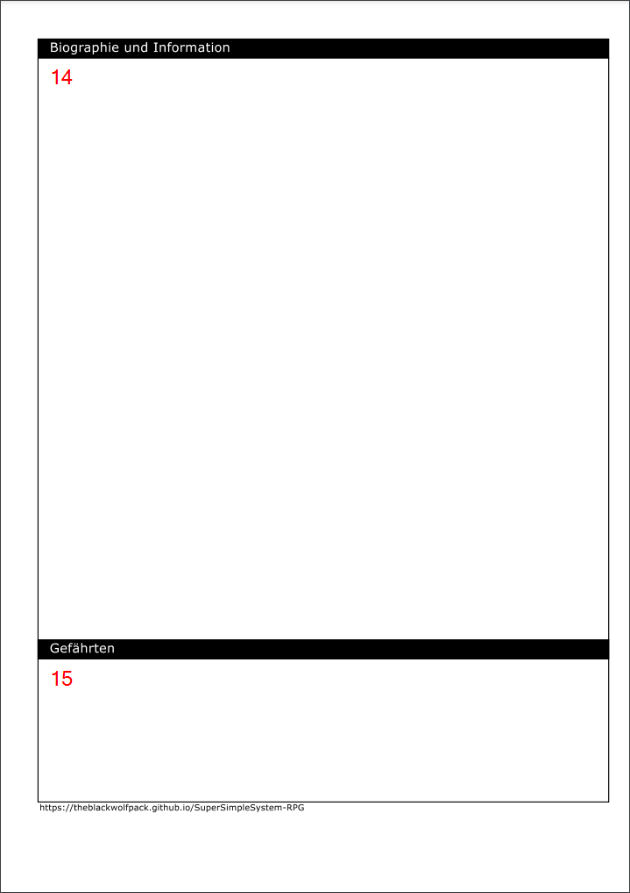

# SuperSimpleSystem RPG - SuperEinfachesSystem Rollenspiel
## 1 Einleitung und Zielsetzung
Herzlich willkommen zum SuperSimpleSystem Rollenspiel. Die meisten der bekannten Rollenspielsysteme bedienen sich einem sehr komplexen Regelwerk um all die Spielmechaniken abzubilden und für möglichst alle Spielsituationen eine passende Regel zur Verfügung zu stellen. Während dadurch zwar sichergestellt wird, dass es kaum Diskussionen darüber gibt was möglich ist und was nicht, kann man - sowohl als Spieler als auch als Spielleiter - schnell den Überblick verlieren.  
Das SuperSimpleSystem Rollenspiel soll dazu eine schlanke und einfach handzuhabende Alternative bieten. Die Grundregeln sollen auf das absolut notwendige reduziert werden, so dass sich auch Kinder leicht in diesem System zurecht finden. Gleichzeitig soll es aber flexibel genug sein um auch erfahrenen Rollenspielern einen unterhaltsamen Rollenspiel-Alltag zu ermöglichen. Außerdem soll damit auch jedes erdenkliche Spieluniversum (Fantasy, Science-Fiction, ...) abgedeckt werden können.

## 1.1 Lizenz
SuperSimpleSystem RPG von [TheBlackWolfPack](https://theblackwolfpack.github.io/) ist lizenziert unter einer [Creative Commons Namensnennung - Weitergabe unter gleichen Bedingungen 4.0 International Lizenz](http://creativecommons.org/licenses/by-sa/4.0/)  
Eine Kopie der Lizenz kann unter [http://creativecommons.org/licenses/by-sa/4.0/](http://creativecommons.org/licenses/by-sa/4.0/) abgerufen werden.  
  
Weitere Infos unter [https://theblackwolfpack.github.io/SuperSimpleSystem-RPG](https://theblackwolfpack.github.io/SuperSimpleSystem-RPG)

---

## 2 Die Grundregeln im Überblick

### 2.1 Würfelprobe
Alle Proben auf Charaktereigenschaften, Talente und Fertigkeiten erfolgen mit einem 20seitigen Würfel (kurz 1W20). Für einen Erfolg muss der gewürfelte Wert kleiner oder gleich dem entsprechenden Wert am Charakterbogen (siehe Kapitel [***5 Dein Charakterbogen***](#5-dein-charakterbogen)) sein.

#### 2.1.1 kritischer Erfolg
Ein Würfelergebnis von 1 stellt dabei einen "kritischen Erfolg", also ein besonders gutes Gelingen der gespielten Handlung dar. Es obliegt dabei Deinem Spielleiter die Auswirkung des kritischen Erfolges zu bestimmen. Beispielsweise können bei einem Angriff zusätzliche Schadenspunkte verteilt werden. Oder es werden zusätzliche Informationen bei der Beobachtung einer Situation offen gelegt.

#### 2.1.2 kritisher Misserfolg
Das Gegenstück zum kritischen Erfolg sellt der "kritische Misserfolg" dar. Also eine besonders missglückte Handlung. Dieser tritt bei einem Würfelergebnsis von 20 ein. Auch hier entscheidet der Spielleiter über die Asuwirkung. Beispielsweise könnte ein Anriff den Angreifer selbst oder einen Mitspieler treffen. Oder man stößt beim Anschleichen einen Stapel Geschirr um.

---

## 3 Schaden und Heilung
Wie in jedem Rollenspiel werden die Spieler früher oder später Verletzungen oder Vergiftungen erleiden. Sei es im Kampf oder bei einem Sturz oder Unfall. Der erlittene Schaden wird dabei von den Trefferpunkten ("Lebenskraft") des Charakters (siehe Kapitel [***5 Dein Charakterbogen***](#5-dein-charakterbogen)) abgezogen.

### 3.1 Schadensermittlung
Der erlittene Schaden errechnet sich prinzipiell aus den Schadenspunkten einer Aktion abzüglich anwendbarer Rüstungswerte. In besonderen Fällen können sich Charaktere auch Verletzungen wie Wunden, Knochenbrüche oder ähnliches einhandeln. Meist passiert das bei einem kritischen Misserfolg des spielenden Charakters oder aber durch einen kritischen Erfolg des Gegners. Die Art der Verletzung, ihre Auswirkung und die Dauer zur Heilung legt Dein Spielleiter oder Deine Spielleiterin fest.

#### 3.1.1 Ermittlung der Schadenspunkte
Die Ermittlung der Schadenspunkte (SP) einer Aktion erfolgt mittels einem oderer mehrerer 6seitiger Würfel (1W6, 2W6, ...). Die Anzahl der anzuwendenend Würfel ergibt sich entweder aus den entsprechenden Angaben einer Fertigkeit im Charakterbogen oder wird bei fehlender Angabe im Charakterbogen vom Spielleiter festgelegt (Beispiel: Sturz von einer Mauer).

#### 3.1.2 Rüstungswerte
Rüstung vermindert den erlittenen Schaden. Je nach Schadensart kann eine Rüstung mehr oder weniger, oder auch gar nicht wirksam sein. Die entsprechend anwendbaren Schadensarten und Rüstungspunkte (RP) finden sich in der Beschreibung der jeweiligen Rüstung. Dabei ist es unerheblich ob eine Rüstung materiell (z.B. Eisenrüstung) ist oder nicht (z.B. magischer Schild).

#### 3.1.3 erlittener Schaden
Der tatsächlich erlittene Schaden (SP-RP) ist von den aktuellen Trefferpunkten (TP) im Charakterbogen abzuziehen.

##### 3.1.3.1 Bewusstlosigkeit und Tod
Fallen die verbliebenen Trefferpunkte eines Charakters durch den erlittenen Schaden auf 0 entscheidet die Spielleitung situationsabhängig ob dieser stirbt oder nur bewusstlos ist. Der Tod muss aber noch nicht das endgültige Ende des Charakters bedeuten. Beispielsweise kann ein anderer Spieler den toten Spieler je nach Spieluniversum durch einen Zauber oder auch eine Handlung wieder ins Leben zurück holen. Bewusstlose Spieler müssen ebenfalls zeitnah versorgt und stabilisiert werden sonst sterben sie ebenfalls.

### 3.2 Heilung
Das Wiederherstellen von Trefferpunkten ("Lebenskraft") kann durch zwei grundsätzliche Wege erfolgen:

#### 3.2.1 Rast & Schlaf
Durch rasten oder schlafen können Trefferpunkte wiederhergestellt werden. Eine Rast stellt dabei maximal ein viertel der Trefferpunkte wieder her. Schlaf maximal die Hälfte der Trefferpunkte.  
Wunden, Brüche und sonstige Verletzungen werden durch einmaliges rasten oder schlafen nicht geheilt.

#### 3.2.2 Hilfsmittel
Durch Hilfsmittel wie Verbände, Wundauflagen, Tränke, Zauber, Medikamente oder Ähnliches lässt sich der Heilungsprozess beschleunigen. Diese Hilfsmittel stellen entweder eine bestimmte Anzahl Trefferpunkte wieder her oder entfernen bestimmte Statuseffekte. (z.B. vergiftet, gelähmt, blind)  
Für Hilfsmittel ist keine Würfelprobe erforderlich. Die Wirkung ergibt sich aus der Beschreibung des Hilfsmittels. Wenn Du Dir nicht sicher bist frag Deinen Spielleiter oder Deine Spielleiterin.

---

## 4 Spielablauf

### 4.1 genereller Spielablauf
Jedes Spiel hat einen Spielleiter oder eine Spielleiterin und mindestens zwei oder mehr Spielende. Jeder Spielende kann immer einen Charakter (Helden) verkörpern. Die Gruppe kann auch weitere Begleiter enthalten welche aber von der Spielleitung gespielt werden. Gespielt wird grundsätzlich in einer erzählenden Spielweise. Der Spielleiter oder die Spielleiterin führt die Spielenden durch die Geschichte, spielt alle Nicht-Spieler-Figuren (NPCs) der Handlung und entscheidet was in der aktuellen Situation möglich ist und was nicht. Die Spielenden versetzen sich dabei in die Rolle ihrer Charaktere und erleben darin das Abenteuer und erzählen was sie gerade tun möchten. Spielleiter oder Spielleiterin entscheiden dann gegebenenfalls ob für die gewünschte Handlung eine Würfelprobe erforderlich ist.

### 4.2 Begegnungen
Im Verlaufe einer Geschichte wird die Heldengruppe immer wieder auf andere Figuren treffen. Manche davon werden ihnen freundlich, oder zumindest höflich, begegnen. Andere wiederum feindselig. Oft werden solche Begegnungen in einfachen Gesprächen zwischen Spielern und Spielleitung erzählt.

#### 4.2.1 Kämpfe
Im äußersten Fall aber kann es es zum Kampf kommen. Kämpfe werden grundsätzlich in einzelnen Kampfrunden ausgetragen. Für jede Kampfrunde stehen jeder Figur eine bestimmte Anzahl an Aktionspunkten (AP) zur Verfügung. Diese findest Du auf Deinem Charakterbogen (siehe Kapitel [***5 Dein Charakterbogen***](#5-dein-charakterbogen)) und können frei nach Belieben eingesetzt werden. Reichen Deine AP nicht aus um eine Handlung in der aktuellen Kampfrunde abzuschließen, werden die noch offenen AP in der/den darauffolgenden Kampfrunde/n verbraucht bis alle AP für die Handlung aufgebracht wurden. Durch Statuseffekte oder Hilfsmittel können die zur Verfügung stehenden AP pro Kampfrunde verringert oder erhöht werden.

##### 4.2.1.1 Austragung der Kampfrunden
Kampfrunden werden immer in der gleichen Reihenfolge aller beteiligter Akteure gespielt. Diese kann situationsabhängig festgelegt werden durch:
* Position der Akteure auf dem Spielplan
* Initiative (Würfelprobe 1W20; je niedriger die Zahl desto früher ist der Akteur an der Reihe)
* Abhängigkeit von der Situation durch die Spielleitung (Hinterhalt, ...)  

Jede Akteur kann in einer Kampfrunde alle AP seiner Figur aufbrauchen. Nicht verbrauchte AP verfallen. In der nächsten Kampfrunde stehen dem Akteur wieder alle AP inkl. anwendbarer Boni und Mali zur Verfügung. Statuseffekte sind dabei entsprechend anzuwenden (z.B. Lähmung)

##### 4.2.1.2 Ende eines Kampfes
Ein Kampf endet durch:  
* Bewusstlosigkeit oder Tod aller Gegner
* Bewusstlosigkeit oder Tod aller Spieler
* Flucht aller Gegner
* Flucht aller Spieler
* Kapitulation der Gegner
* Sonderereignisse durch die Spielleitung (z.B. eine einschreitende Stadtwache)

### 4.3 Aktionen außerhalb von Kämpfen
Die Helden können - je nach ihren Fertigkeiten - unterschiedliche Hanldungen außerhalb von Kämpfen ausführen. Beispiele hierfür sind das Herstellen von Waffen und Ausrüstung, das Brauen von Tränken oder das Wirken bestimmter Zauber. Möchtest Du eine solche Aktion ausführen informiere Deinen Spielleiter darüber und führe gegebenenfalls die erforderliche Würfelprobe aus. Dein Spielleiter entscheidet dabei ob die Aktion grundsätzlich zum aktuellen Zeitpunkt ausführbar ist oder nicht. Er entscheidet auch darüber wieviel Zeit Du dafür benötigst falls dies nicht in der Beschreibung der Aktion angeführt ist. AP werden dabei nicht verbraucht.

### 4.4 Spielleitung
Spielleiterinnen und Spielleitern kommt in Rollenspielen eine zentrale Rolle zu. Ihnen obliegt es die Spieler durch die Geschichte zu führen, alle Nicht-Spieler-Figuren zu spielen sowie darüber zu entscheiden was möglich ist und was nicht. Die Entscheidungen der Spielleitung sind bindend und stehen nicht zur Diskussion. Sollte Dir Dein Spielleiter oder Deine Spielleiterin eine Aktion nicht erlauben hat das bestimmt einen guten Grund.  
Möchtest Du selbst einmal die Spielleitung übernehmen, dann lies bitte unser [Spielleiterhandbuch](https://theblackwolfpack.github.io/SuperSimpleSystem-RPG/de_game_masters_guide.pdf). Darin findest Du alle Informationen die Du brauchst um Dein erstes Abenteuer zu leiten.

---

## 5 Dein Charakterbogen
Für jede Figur die Du im Rollenspiel verkörpern möchtest benötigst Du einen Charakterbogen. Dabei kann es sich um ein einfaches Blatt Papier handeln auf dem Du alle wichtigen Informationen aufschreibst, einen vorgefertigten Ausdruck in den Du nur die Werte eintragen musst oder auch um eine digitale Ausgabe auf Deinem Smartphone, Tablet oder PC.
Vorgefertigte Charakterbögen findest Du unter anderem auf unserer [Downloadseite](https://theblackwolfpack.github.io/SuperSimpleSystem-RPG/downloads#character-sheets)

### 5.1 Überblick über den Charakterbogen
  
1 Bild Deines Charakters | 
2 Name Deines Charakters | 
3 Rasse Deines Charakters | 
4 Klasse Deines Charakters | 
5 Alter Deines Charakters | 
6 aktuell verfügbare Steigerungspunkte | 
7 aktuelle Stufe Deines Charakters | 
8 aktuelle Trefferpunkte | 
9 verfügbare Aktionspunkte | 
10 aktuelle Rüstungspunkte | 
11 Eigenschaften und Talente Deines Charakters | 
12 mitgeführte Ausrüstung Deines Charakters | 
13 die Fertigkeiten Deines Charakters
  
  
14 die Hintergrundgeschichte Deines Charakters | 
15 die aktullen Begleiter Deines Charakters

### 5.2 Eigenschaften und Talente
Die Eigenschafts- und Talentwerte werden einmalig bei der Charaktererstellung gewürfelt. Für jeden Eintrag würfelst Du mit drei sechsseitigen Würfeln (3W6). Somit kann jede Deiner Eigenschaften und Talente einen Wert zwischen 3 und 18 bekommen. Du kannst bei jedem Wurf entscheiden welchem Eigenschafts- oder Talentwert Du diesen zuweisen möchtest. Aber ein Wert der einmal zugewiesen ist kann dann nicht mehr geändert werden.
Im Verlauf eines Abenteuers wirst Du viele Würfelproben auf diese Werte durchführen.

#### 5.2.1 Ausdauer
Ausdauer ist wichtig bei längeren, körperlich anstrengenden Tätigkeiten. Beispielsweise kannst Du umso länger bzw. schneller laufen je besser Deine Ausdauer ist. Auch anstrengende handwerkliche Tätigkeiten gehen Dir leichter von der Hand wenn Du eine bessere Ausdauer hast.

#### 5.2.2 Charisma
Bist Du ein feiner Pinkel oder ein grobschlächtiger Rabauke? Nehmen Dich Deine Begleiter als starken und pflichtbewussten Anführer wahr oder suchen sie lieber bei der erstbesten Gelegenheit das Weite? Die Antwort darauf hängt ganz davon ab wie charismatisch Du bist. Je höher Dein Charisma desto mehr Ansehen wirst Du genießen und desto eher glaubt man Dir was Du sagst.

#### 5.2.3 Geschicklichkeit
Ob Du ein Tollpatsch oder ein Meister der Körperbeherrschung bist zeigt sich mit Deinem Geschicklichkeitswert. Je besser dieser ist, desto besser stehen Deine Chancen zum Beispiel mit Deinem Bogen das gewünschte Ziel zu treffen.

#### 5.2.4 Intelligenz
Egal ob Du jahrelang Bücher studiert oder durch Ausprobieren an Dein Wissen gelangt bist. Eines steht fest: was Du einmal gelernt hast, kann Dir niemand mehr nehmen. Lesen, schreiben und rechnen tragen dazu bei Dich weiter fortzubilden. Je mehr Du das machst desto intelligenter wirst Du. Aber auch Lebenserfahrung steigert Dein Wissen und Deine Intelligenz. Und die braucht es um alchemistische Rezepte oder Bauanleitungen für Waffen zu verstehen. Auch aufgestellte Fallen funktionieren besser wenn sie gut durchdacht sind.

#### 5.2.5 Körperkraft
Bist Du ein Kraftpaket oder doch eher ein zartes Mauerblümmchen? Ein Schwertkämpfer wird seine Waffe nur sicher führen können, wenn er auch stark genug dazu ist. Auch manche handwerklichen Tätigkeiten erfordern einiges an Kraft. Ein wenig Muskeltraining kann also nicht schaden. Für filigrane Zauber braucht es hingegen die Kraft des Geistes, nicht des Körpers.

### 5.3 Fertigkeiten
Neben den Eigenschaften und Talenten Deiness Charakters kann dieser noch weitere angeborene oder erlernte Fertigkeiten besitzen. Beispielsweise ist einem Werwolf angeboren, dass er seine Gestalt verändern kann. Das brauen von Tränken hingegen will gelernt sein.  
Jede Rasse und Klasse hat angeborene oder bei Charaktererstellung bereits erlernte Fertigkeiten. Die Details dazu findest Du in den [Fertigkeitsbeschreibungen](https://theblackwolfpack.github.io/SuperSimpleSystem-RPG/downloads#skills).  
Der Bereich Fertigkeiten auf Deinem Charakterbogen gliedert sich in drei Spalten:

#### 5.3.1 Fertigkeit
In der Spalte Fertigkeit werden der Name sowie zusätzliche Beschreibungen eingetragen. Beispielsweise kannst Du hier vermerken wieviel Du von welchen Zutaten aufbringen musst um einen Trank zu brauen. Oder auf welche Eigenschaft oder Talent Du eine Würfelprobe machen musst.

#### 5.3.2 Würfel
Für Fertigkeiten welche eine Würfelprobe erfordern kannst Du in dieser Spalte den/die zu verwendenden Würfel eintragen. Dies können im SuperSimpleSystem-RPG entweder zwanzigseitige Würfel (1W20, 2W20, ...) für Proben auf Eigenschaften oder Talente, oder sechsseitige Würfel (1W6, 2W6, ...) für Schadens- und Heilungspunkte sein. 

#### 5.3.3 Ergebnis & Aktion
Im Feld Ergebnis & Aktion kannst Du das letzte Würfelergebnis eintragen oder - falls Du den [NBOS Character Sheet Viewer](https://nbos.com/products/character-sheet) oder ein roll template oder Macro von [Roll20](https://roll20.net/) verwendest - auch den entsprechenden Würfelwurf ausführen.

### 5.4 Training (Steigerung von Eigenschaften, Talenten und Fertigkeiten)
Die Eigenschaften, Talente und Fertigkeiten Deines Charakters lassen sich mithilfe von sogenannten Steigerungspunkten (SP) verbessern. Wir nennen das Training. 
Dabei unterscheiden wir zwischen direkt steigerbaren Eigenschaften, Talenten und Fertigkeiten und jenen die sich über einen Aufstieg Deines Charakters in die nächste Erfahrungsstufe verbessern.  
Die dafür notwendigen SP sammelst Du in Deinen Abenteuern im Spiel. Je mehr Abenteuer Du erlebst desto mehr Erfahrung sammelst Du. Und dafür bekommst Du am Ende jedes Abenteuers eine entsprechende Anzahl an Steigerungspunkten von Deinem Spielleiter oder Deiner Spielleiterin. Die Anzahl der zu vergebenden SP richtet sich dabei grob nach der Länge (Spieldauer) des Abenteuers sowie an den Aufgaben die dabei zu bewältigen waren. (Art und Anzahl der Gegner, Schwierigkeitsgrad von Rätseln, etc.) Am Ende entscheidet aber die Spielleitung darüber welcher Charakter wieviel Steigerungspunkte erhält. Und es ist nicht ungewöhnlich, dass die unterschiedlichen Charaktere einer Heldengruppe in einem Abenteuer unterschiedlich viele SP sammeln.  
Es ist ratsam das Training direkt nach Abschluss des Abenteuers in Abstimmung mit der Spielleitung durchzuführen. So haben es sowohl Du als auch Deine Spielleiter leichter Euch auf das nächste Abenteuer vorzubereiten. Ein Training im Verlauf eines Abenteuers ist nicht üblich. In besonderen Fällen kann es die Spielleitung aber nach eigenem Ermessen erlauben.

#### 5.4.1 direkt steigerbare Eigenschaften und Talente
Bestimmte Eigenschaften und Talente lassen sich direkt mittels Steigerungspunkten verbessern. Eine Verbesserung durch einen Stufenaufstieg erfolgt bei diesen nicht.  
Eigenschaft/Talent | einzusetzende Steigerungspunkte | maximaler Eigenschafts- / Talentwert
-------------------|---------------------------------|--------------------------------------
Ausdauer | 3 | 18
Körperkraft | 4 | 18

#### 5.4.2 direkt steigerbare Fertigkeiten
Auch manche Fertigkeiten lassen sich direkt unter Einsatz von Steigerungspunkten verbessern. Eine indirekte Steigerung mittels Stufenaufstieg erfolgt dabei in der Regel dann nicht. Die Details findest Du in der ausführlichen Beschreibung der jeweiligen Fertigkeit in den [Fertigkeitsbeschreibungen](https://theblackwolfpack.github.io/SuperSimpleSystem-RPG/downloads#skills).

#### 5.4.3 Stufenaufstieg
Eigenschaften, Talente und Fertigkeiten welche nicht direkt trainiert werden können verbessern sich wenn Dein Charakter eine Stufe aufsteigt. Jeder neue Charakter beginnt dabei in der Stufe 0 und kann bis zur Stufe 10 aufsteigen.  
Der Stufenaufstieg erfolgt ähnlich wie das Training durch den Einsatz von Steigerungspunkten. Wieviel Punkte Du einsetzten musst ist dabei abhänging von Rasse und Klasse Deines Charakters. Ganz allgemein gilt: je höher die aktuelle Stufe Deines Charakters bereits ist, desto mehr Steigerungspunkte benötigst Du um in die nächste aufzusteigen. Die Details dazu findest Du in den entsprechenden [Rasse-](https://theblackwolfpack.github.io/SuperSimpleSystem-RPG/downloads#races) und [Klassebeschreibungen](https://theblackwolfpack.github.io/SuperSimpleSystem-RPG/downloads#classes).

### 5.5 Erlernen neuer Fertigkeiten
Im Verlaufe Deiner Abenteuer wirst Du immer wieder die Gelegenheit bekommen neue Fertigkeiten zu erlernen. Manche der Fertigkeiten können nur ab einer bestimmten Stufe oder nur von Charakteren einer bestimmten Rasse und/oder Klasse erlernt werden. Alle Details dazu sowie die genauen Beschreibungen aller Fertigkeiten findest Du in den [Fertigkeitsbeschreibungen](https://theblackwolfpack.github.io/SuperSimpleSystem-RPG/downloads#skills).  

#### 5.5.1 Bauanleitungen für Ausrüstung
Entsprechendes Geschick und Material vorausgesetzt, kannst Du mit Hilfe von Bauanleitungen neue Ausrüstungsgegenstände selbst herstellen. Du wirst immer wieder mal auf Leute treffen die Dir entweder eine fertige Bauanleitung verkaufen oder die Dir die entsprechende Fertigkeit lehren (und Du Dir dabei selbst die Bauanleitung schreibst). Manchmal erhältst Du auch eine Bauanleitung als Belohnung für eine Aufgabe die Du für jemanden erledigt hast. Oder Du bist ein richtiger Glückspilz und findest eine Bauanleitung irgendwo versteckt.  
Bist Du einmal im Besitz einer Bauanleitung darfst Du diese als neue Fertigkeit in Deinen Charakterbogen aufnehmen sofern Dein Charakter die Voraussetzungen zur Anwendung der Fertigkeit erfüllt.  
Du kannst eine Bauanleitung auch an einen Deiner Mitspieler weitergeben solange Du sie nicht in Deine Fertigkeiten aufgenommen hast. Ausgenommen hiervon sind Fertigkeiten die Du gelehrt bekommst.  
Bauanleitungen gibt es unter Anderem für verschiedene Arten von Pfeilen und Bolzen, den Bau von Bögen oder das Schmieden von Waffen und Rüstungen. Aber auch für den Bau von Fallen, Beuteln, Rucksäcken oder anderen nützlichen Gegenständen.

#### 5.5.2 Rezepturen für Tränke, Tinkturen, Salben und Ähnliches
Ähnlich wie Bauanleitungen für Ausrüstung gibt es auch Rezepte für allerlei Tränke, Tinkturen, Salben und anderes alchemistisches Gebräu. Auch diese Rezepte werden Dir teilweise für erledigte Aufgaben überlassen oder man bietet sie Dir zum Verkauf oder zur Lehre an. Auch ein zufälliger Fund eines versteckten Rezeptes ist durchaus möglich. Je nach Aufbau der Welt fällt auch die Anfertigung von Medikamenten in diese Kategorie.  
Auch für Rezepte gilt, dass Du diese an andere Spieler weitergeben kannst solange Du sie selbst noch nicht in Deine Fertigkeiten aufgenommen hast. Ausgenommen hiervon sind Rezepte welche Du gelehrt bekommst.

#### 5.5.3 Zaubersprüche
Eine Besonderheit unter den Fertigkeiten stellen Zaubersprüche dar. Unter Zaubersprüche fallen sowohl die Anwendung von Magie als auch aller anderen Arten übernatürlicher Kräfte. Sie können ausschließlich erlernt werden, was auch einige Zeit in Anspruch nimmt.  
Entweder Du findest einen Meister, der Dich einen bestimmten Zauber lehren kann, oder aber Du erforscht einen neuen Zauber durch eigene Experimente. Zweiteres nimmt aber deutlich mehr Zeit in Anspruch und ist nicht ganz ungefährlich. Vor allem für die Leute in Deiner Umgebung. Du solltest Deine Experimente also besser an abgelegenen Orten durchführen. Und idealerweise ohne brennbare Materialien in Deiner Nähe...  
Möchtest Du einen neuen Zauber erlernen sprich mit Deinem Spielleiter oder Deiner Spielleiterin.

#### 5.5.4 Sonstiges
Natürlich gibt es noch viele weitere Fertigkeiten, die Dein Charakter erlangen kann. Seien es angeborene Fähigkeiten wie die Gestaltwandlung von Werwölfen oder erlernbare wie Taschendiebstahl oder Fallen zu stellen.  
Du findest alle Fertigkeiten in den [Fertigkeitsbeschreibungen](https://theblackwolfpack.github.io/SuperSimpleSystem-RPG/downloads#skills). Für jede Fertigkeit ist dort ausgewiesen ob diese angeboren ist oder aber erlernt werden kann.

## 6 das Abenteuer beginnt
Nun solltest Du Deinen Charakter erschaffen haben und kennst alle Regeln um in Dein erstes Abenteuer zu starten!  
Und keine Sorge, es ist ganz normal, dass Dir am Anfang noch ein paar Dinge im Spielverlauf nicht ganz klar sein werden. Scheue Dich in so einem Fall nicht an Deine Spielleiterin oder Deinen Spielleiter heranzutreten und zu fragen. Sie werden Dir gerne Auskunft geben. Du wirst im Laufe der Zeit auch feststellen, dass verschiedene Spielleiter gewisse Dinge unterschiedlich handhaben. Das ist ganz normal und im Rahmen der Möglichkeiten. Richte Dich daher bitte danach was die Spielleitung vorgibt.  
Nun aber los! Auf ins erste Abenteuer!

### 6.1 vorgefertigte Abenteuer
Auf unserer Website haben wir eine eigene Rubrik [Abenteuer](https://theblackwolfpack.github.io/SuperSimpleSystem-RPG/adventures). Hier findest Du eine Sammlung von Abenteuern mit denen Du sofort loslegen kannst. Sie enthalten sowohl die Hauptgeschichte, als auch verschiedene Nebenaufgaben für die Spieler sowie alle notwendigen Karten, Bilder der Figuren welche in dem Abenteuer eine Rolle spielen und möglicherweise noch einiges an Zusatzmaterial.

### 6.2 schreibe Dein eigenes Abenteuer
Aber natürlich kannst Du auch jederzeit Deine eigene Welt erschaffen und darin die verrücktesten Abenteuer bestreiten. Und wenn Du auch andere an Deinen Abenteuern teilhaben lassen möchtest, kannst Du es gerne mit uns teilen und es erscheint dann für Andere in unserer [Abenteuerliste](https://theblackwolfpack.github.io/SuperSimpleSystem-RPG/adventures).

## 7 Schlussbemerkungen

Mit dem hier vorliegenden Grundregelwerk bist Du in der Lage jedes Spiel nach dem "SuperSimpleSystem Rollenspiel" zu spielen. Darüber hinaus solltest Du Dich aber noch mit den [Rasse-](https://theblackwolfpack.github.io/SuperSimpleSystem-RPG/downloads#races) und [Klassebeschreibungen](https://theblackwolfpack.github.io/SuperSimpleSystem-RPG/downloads#classes) sowie den [Fertigkeitsbeschreibungen](https://theblackwolfpack.github.io/SuperSimpleSystem-RPG/downloads#skills) auseinandersetzten. Dort findest Du viele weiterführende Informationen, die Dir im weiteren Spielverlauf helfen werden. Beastarien mit der Beschreibung aller möglicher Tiere und Monster sind noch in Planung. Da diese stark von der Spielwelt abhängig sind werden diese aber Umfang der [Abenteuer](https://theblackwolfpack.github.io/SuperSimpleSystem-RPG/adventures) sein.

### 7.1 Fehler
Das hier vorliegende Basis-Regelwerk wurde von Menschen geschrieben. Daher können wir - auch nach eingehender Prüfung - nicht gänzlich ausschließen, dass sich doch noch irgendwo ein Fehlerteufelchen eingeschlichen hat. Oder es in bestimmten Spielsituationen zu Unklarheiten kommt. Sollte Dir etwas aufgefallen sein lass es uns doch bitte wissen. Entweder Du erstellt einen neuen [Fehlerbericht auf Github](https://github.com/TheBlackWolfPack/SuperSimpleSystem-RPG/issues/new?assignees=&labels=&template=bug_report.md) oder Du schickst uns eine [Email mit der Fehlerbeschreibung](mailto:SuperSimpleSystemRPG@gmail.com) dazu.